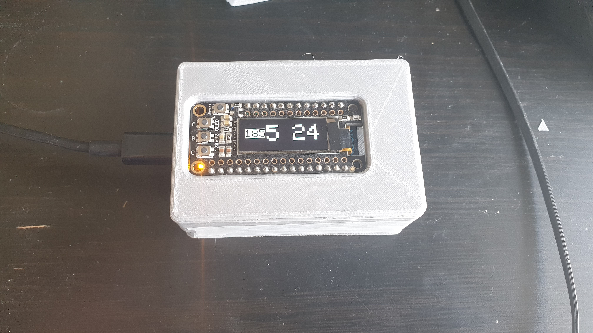
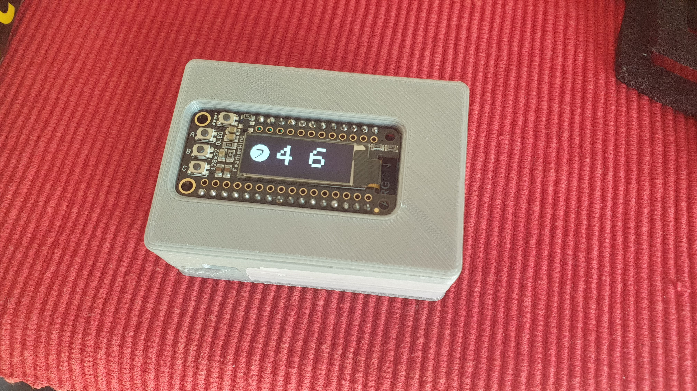
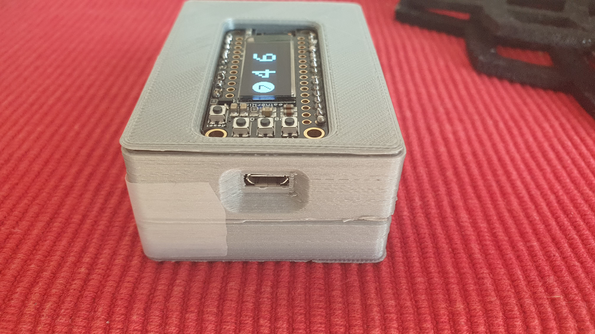

# particle-ratp-display

Ce petit projet a pour but de fournir un affichage rudimentaire avec les horaires du prochain métro / bus / rer.

L'API de Pierre Grimaud est utilisée pour récupérer ces données.
(https://api-ratp.pierre-grimaud.fr/v4/ , https://github.com/pgrimaud/ratp-api-rest)

## Materiel

J'ai utilisé :
- une Particle Argon (https://docs.particle.io/argon/)
- une Adafruit FeatherWing OLED (https://www.adafruit.com/product/2900)
- une batterie 3.6V 1000mAh

## Photos

  

## Installation

Pour obtenir les informations de l'API, j'ai utilisé les webhooks disponibles sur la console Particle.

Voici le custom template utilisé pour récupérer les horaires des métros à la station Place d'Italie sur la ligne 7 :
```
{
    "event": "horaire_ligne7",
    "responseTopic": "",
    "errorResponseTopic": "",
    "url": "https://api-ratp.pierre-grimaud.fr/v4/schedules/metros/7/place+d'italie/A",
    "requestType": "GET",
    "noDefaults": false,
    "rejectUnauthorized": true,
    "responseTemplate": "{{{result.schedules.0.message}}}/{{{result.schedules.1.message}}}"
}
```

Une fois les webhook mis en place, il suffit d'utiliser le code. Celui-ci fait appel à la librairie **oled-wing-adafruit** qu'il est nécessaire d'importer.

## Fonctionnement

Le bouton A permet de selectionner la ligne 7, le bouton B la ligne 185, et le bouton C d'eteindre l'écran. 


L'écran affiche le temps d'attente des 2 prochains trains / bus.


On peut signaler les problèmes de trafic en mettant une led sur A2.
